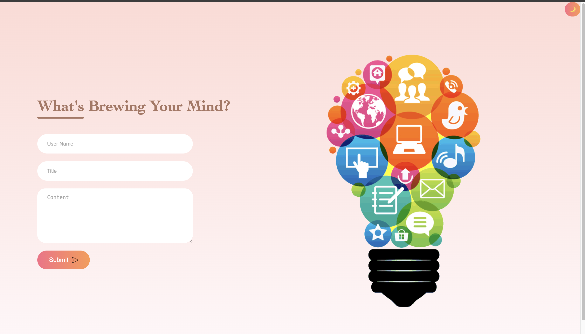
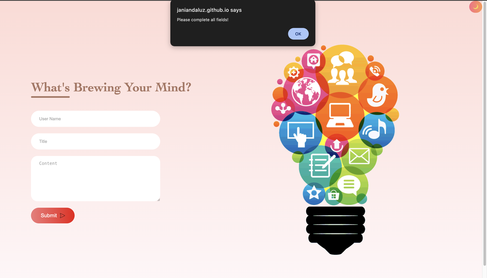
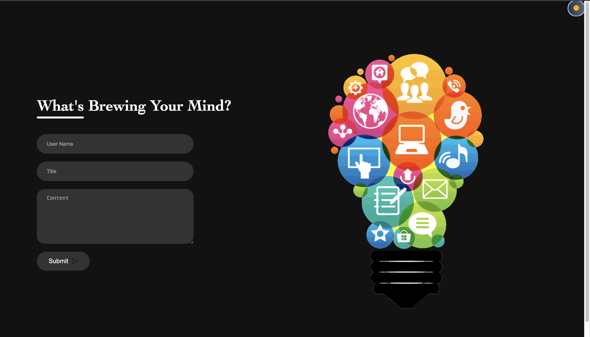
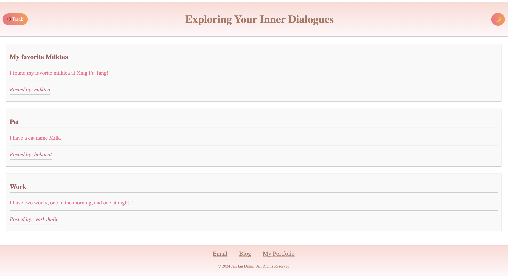
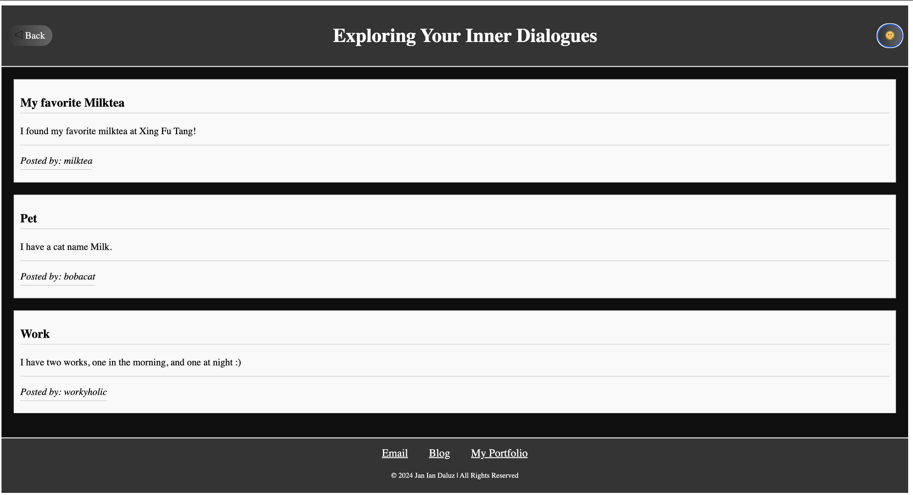

# Personal Blog

## Description
This project is part of the Web APIs Challenge series. It involves creating a two-page website where users can input and view blog posts. The main features include building a content form for users to submit their blog posts, dynamically rendering these posts on a separate page, and implementing a light/dark mode toggle for improved user experience. By working on this project, developers will gain practical experience in JavaScript, explore the power of the Document Object Model (DOM), and set the stage for tackling more advanced web development tasks.

## Usage
To use this application, follow these steps:

1. Navigate to the landing page of the website.
2. Input your username, blog title, and blog content into the provided form.
3. Submit the form to create a new blog post.
4. Navigate to the posts page to view all submitted blog posts.
5. Use the light/dark mode toggle to adjust the appearance of the website according to your preference.
6. Click the "Back" button to return to the landing page and input more blog entries.

[&rarr; This is the link to the website](https://janiandaluz.github.io/personal-blog/)

[&rarr; This is the link to the GitHub repository](https://github.com/janiandaluz/personal-blog)

## Functions
- Input Form: Allows users to input their username, blog title, and blog content.
- LocalStorage: Stores blog post data locally, enabling persistent storage and retrieval.
- Dynamic Rendering: Dynamically renders blog posts on a separate page for users to view.
- Light/Dark Mode Toggle: Implements a toggle switch to change the appearance of the website between light and dark modes.

## Technologies Used
- HTML5: Markup language for structuring the web pages.
- CSS3: Stylesheets for enhancing the visual presentation of the website.
- JavaScript: Programming language for implementing dynamic functionality and interactivity.
- Web APIs: Utilized for accessing browser functionalities such as localStorage.
- Document Object Model (DOM): Manipulated to dynamically update the content of the web pages.

## Contributing
Contributions are welcome! If you find any issues or have suggestions for improvement, feel free to open an issue or submit a pull request.

## Credits
- Credits given to fellow boot campers, TAs, and instructor.
- Credits to the following links:
    - [Creating a Simple Website](https://youtu.be/-HeadgoqJ7A?si=epoAyMSmktXPvtv2)
    - [Color Palette for CSS](https://palettes.shecodes.io/palettes/pink/color)
    - [PNG Images](https://www.pngegg.com/en/png-nwvom)
    - [Iconpacks](https://www.iconpacks.net/free-icon/left-arrow-6163.html)

## License
This project is licensed under the MIT License.